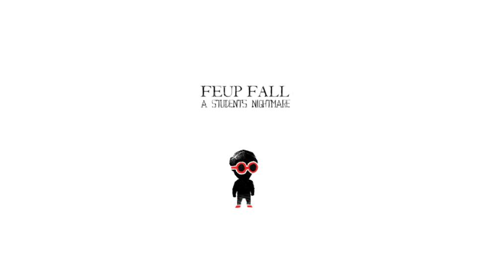
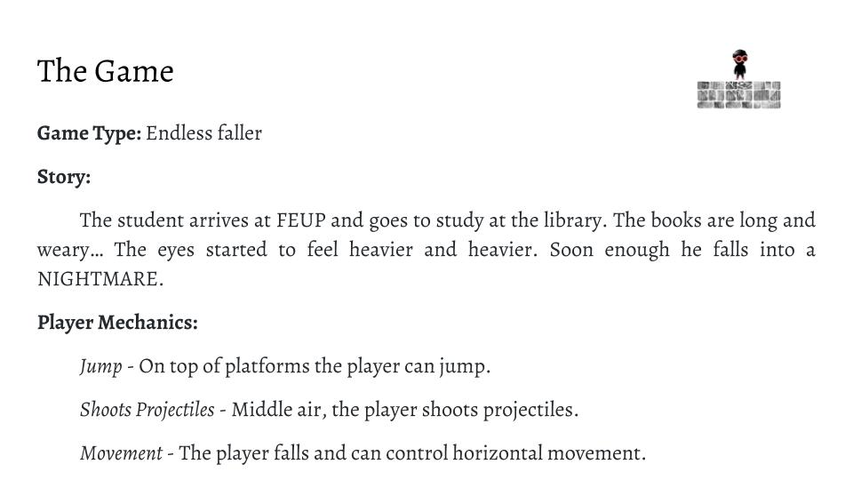
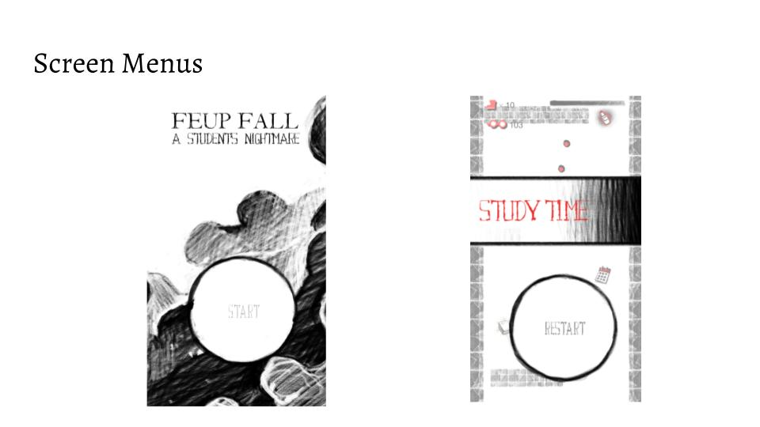
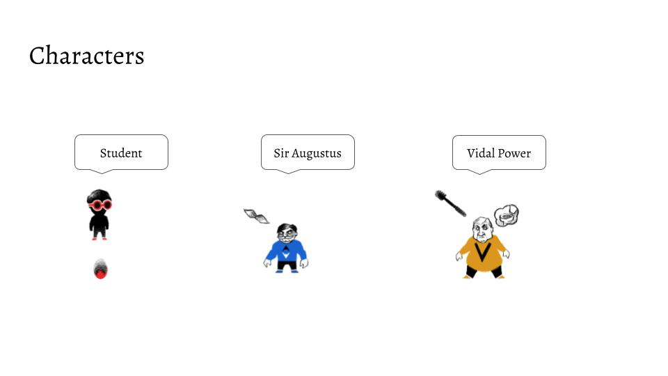
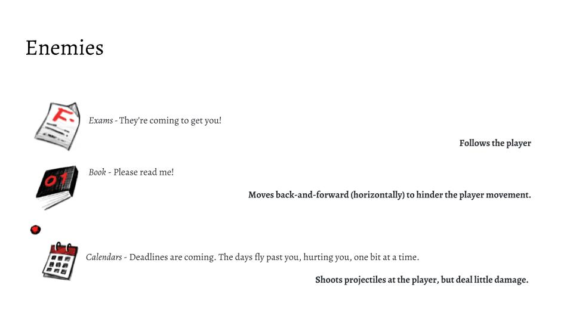
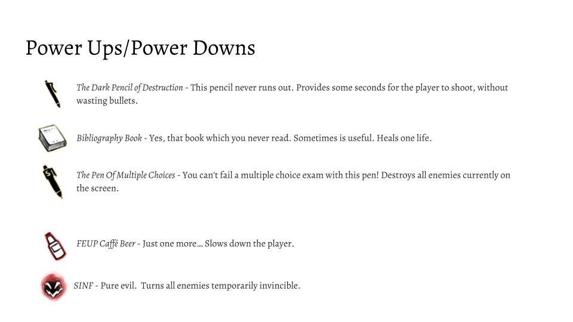
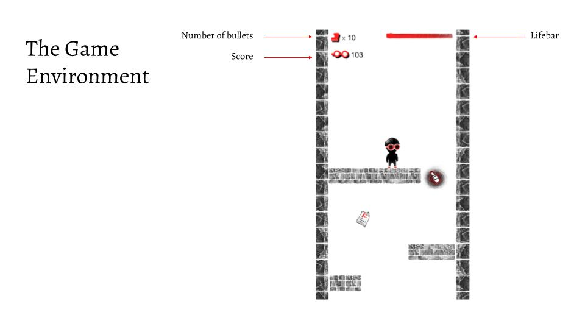
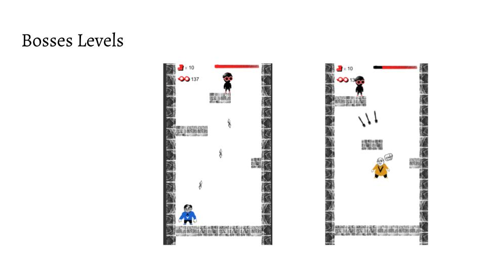
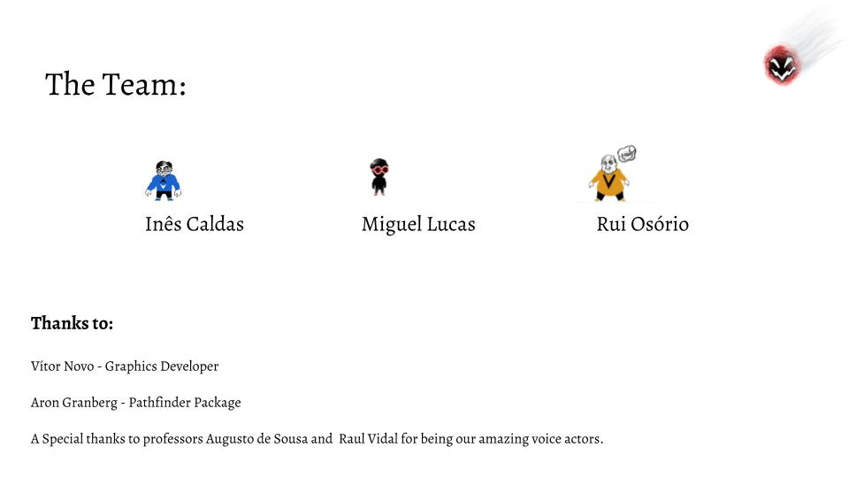

# FeupFall
A endless faller for Android developed for the Computer Games Development course

# Overview

Check a video [here](https://youtu.be/qqLjxX5Xm2w).

Authors:
* [Inês de Sousa Caldas](https://github.com/inessousacaldas)
* [Miguel Lucas](https://github.com/MiguelLucas)
* [Rui Osório](https://github.com/ruiProg)

